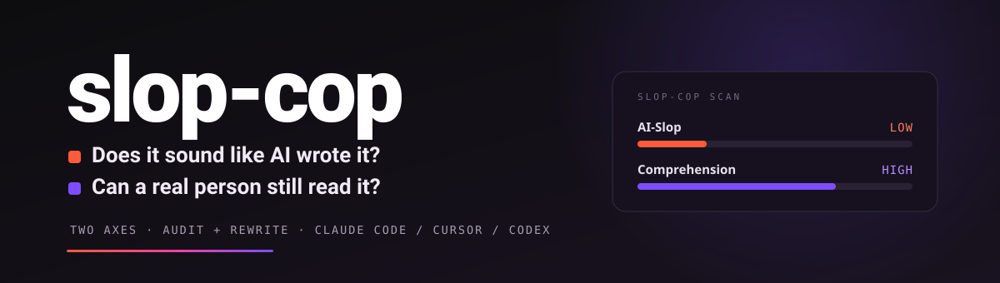

<p align="center">
  
</p>

<p align="center">
  <a href="https://github.com/MahmoudHalat/slop-cop/releases/latest"></a>
  <a href="https://github.com/MahmoudHalat/slop-cop/blob/main/LICENSE"></a>
  <a href="#install"></a>
  <a href="#sources"></a>
  <a href="#what-it-catches"></a>
</p>

---

**slop-cop** is a Claude Code skill that catches sloppy writing before it ships, then rewrites it when you ask.

Our feeds are becoming shit. Our websites are becoming shit. Our repos are becoming shit. AI didn't make writing harder, it made writing easier, and now everyone uses the same shortcuts, the same shapes, the same words. Open ten landing pages in a row and you can't tell them apart.

slop-cop runs two tests on a draft:

- **Does it sound like AI wrote it?** (the AI-Slop test)
- **Can a real person read it?** (the Comprehension test)

A piece can pass one test and fail the other. A blog post might pass the AI test but be too hard to read because it stuffs nine short forms into one paragraph. A casual note might fail the AI test but read just fine.

Hand it a draft. You get back two scores, the words to cut, a guess at which AI made it, and one clear next step. Ask it to fix the draft and it rewrites in a voice you pick, applies the safe fixes on its own, then scans again to prove the rewrite actually landed.

Both tests use density. What matters is how often the patterns pile up close together, not whether one bad word shows up once. And no, this README does not pass its own scanner: a document that quotes every tell it catalogs, in tables and examples, trips the thing hard. The scanner counts what is on the page and can't tell a quoted example from the real one. That is a real limit, and it is exactly why a person still reads the flags instead of trusting the number.

## Why I built this

To make my own websites less shit. To make my clients' websites less shit. To stop my LinkedIn feed from drowning in copy-paste slop. That is the whole point.

Yes, AI wrote parts of this README. That is not the problem. The problem is AI prose that nobody catches: the safe, hedge-stacked, em-dash-heavy paragraph where every line is grammatically clean but the whole thing is forgettable.

I run slop-cop against my own work every day. Landing pages, blog posts, READMEs, pitch decks, cold emails. It catches the stuff I would have shipped. It tells me which paragraph is too dense for a new reader, which sentence sounds AI-shaped, which heading buries the point.

If someone uses this to score other people's writing, fine. But the first job is policing yourself before you ship.

## Why I keep updating it

I run it daily, so I find new things every week. A pattern I missed. A false alarm on real human prose. A new model with new tells. The list moves with the work. Expect a lot of changes.

## Sponsors

<a href="https://givefeedback.dev"></a>GiveFeedback.dev uses AI to turn client screen recordings into clear tasks and stop scope creep.

## Install

One command. The skill drops into your Claude Code skills folder. It runs automatically as a final QA pass on any prose Claude writes for a human reader — emails (internal or external), proposals, reports, blog posts, chat messages — and also wakes up on demand when you say things like *"is this AI"*, *"is this readable"*, *"audit this"*, *"humanize this"*, *"slop check"*.

```bash
curl -L https://github.com/MahmoudHalat/slop-cop/releases/latest/download/ai-slop-detector.skill -o /tmp/slop-cop.zip \
  && unzip -o /tmp/slop-cop.zip -d ~/.claude/skills/ \
  && rm /tmp/slop-cop.zip
```

The skill lands at `~/.claude/skills/ai-slop-detector/`. Restart Claude Code and it loads.

Want git? Clone right in:

```bash
git clone https://github.com/MahmoudHalat/slop-cop.git ~/.claude/skills/ai-slop-detector
```

### Other agents

The skill is a portable `SKILL.md` plus a zero-dependency Python scanner, so it runs
anywhere that reads Agent Skills. Same catalog, same scanner, same rewrite workflow.

| Tool | Where to put it |
|------|-----------------|
| **Claude Code** | `~/.claude/skills/ai-slop-detector/` |
| **Claude Cowork** | install the repo as a plugin (`/plugin marketplace add MahmoudHalat/slop-cop`) |
| **OpenAI Codex** | `~/.agents/skills/ai-slop-detector/` (or `.agents/skills/` in a repo) |
| **Cursor** | clone anywhere, then reference `SKILL.md` from `.cursor/rules/` |
| **Windsurf** | `.windsurf/rules/` referencing `SKILL.md` |
| **Cline** | `.clinerules/` referencing `SKILL.md` |
| **Any other** | point the agent at `SKILL.md`; run `scan.py` for scoring and `--apply-safe` for fixes |

The scanner needs only Python 3 (no packages). On any platform, `scan.py --suggest`
and `--apply-safe` work from the shell even if the agent integration does not.

## Use

Three modes. **Audit** is the default and changes nothing. **Rewrite** returns a
cleaned version with a before/after score. **Edit-in-place** fixes a file and keeps
the parts that already read human.

In Claude Code, just talk to it:

```
audit this draft for AI tells      # audit
is this AI?                        # audit
is this readable?                  # audit
rewrite this to sound human        # rewrite
de-slop this paragraph             # rewrite
humanize this in a warm voice      # rewrite, with a voice
fix this file in place             # edit-in-place
comprehension check                # audit
```

Every rewrite ends with a re-scan, so you get the before/after proof, not a promise.

Or run the scanner straight from the shell:

```bash
# Audit
python3 ~/.claude/skills/ai-slop-detector/scripts/scan.py path/to/draft.md
python3 ~/.claude/skills/ai-slop-detector/scripts/scan.py --quick draft.md
python3 ~/.claude/skills/ai-slop-detector/scripts/scan.py --json draft.md
python3 ~/.claude/skills/ai-slop-detector/scripts/scan.py --genre academic draft.md
python3 ~/.claude/skills/ai-slop-detector/scripts/scan.py --audience marketing draft.md

# Rewrite (hybrid: deterministic safe fixes + a judgment worklist)
python3 ~/.claude/skills/ai-slop-detector/scripts/scan.py --suggest draft.md      # worklist + before-scores (JSON)
python3 ~/.claude/skills/ai-slop-detector/scripts/scan.py --apply-safe draft.md   # meaning-preserving fixes to stdout
python3 ~/.claude/skills/ai-slop-detector/scripts/scan.py --apply-safe --in-place draft.md
echo "your draft text" | python3 ~/.claude/skills/ai-slop-detector/scripts/scan.py
```

`--apply-safe` only makes swaps that never change meaning (em dash → comma,
"utilize" → "use"), and it skips anything inside quotes or code, so a word you are
quoting *as an example* is never rewritten. Everything that needs judgment goes to
the rewrite workflow, where Claude rewrites it in a target voice and re-scans.

## What it looks like

Four real test runs. Note how each test catches different things:

| Sample | AI-Slop | Comprehension | What to do |
|---|---|---|---|
| Hand-written cover letter | **PASS** (1.5) | **PASS** (1.8) | Ship it |
| Dense expert summary | **HIGH** (13.0) | **CRITICAL** (30.0) | Full rewrite |
| Real human pitch (dense) | **LOW** (2.5) | **CRITICAL** (31.0) | Fix the reader-friendliness; the voice is fine |
| AI marketing post | **CRITICAL** (150.9) | **CRITICAL** (22.1) | Full rewrite |

Look at row three. The text reads like a thoughtful human wrote it (low AI score). But it stuffs 36 names and 7 short forms into 359 words with no headings. A new reader has no chance. A simple AI scanner would miss the problem. slop-cop catches both halves.

## What it catches

Two tests. Each one has its own list of patterns the scanner pulls from.

### AI-Slop test

| Layer | Coverage | Source |
|---|---|---|
| **Patterns** | 47 patterns in 6 groups: rhetorical shapes, sentence-level tells, voice, decoration, density, abstraction & agency | [`references/patterns.md`](ai-slop-detector/references/patterns.md) |
| **Words** | 200+ phrases in tiered groups: AI verbs, cliché metaphors, empty boosters, sucking up, vague authority, connector words, spike words, throat-clearing openers, business buzzwords, label asides, blanket absolutes | [`references/vocabulary.md`](ai-slop-detector/references/vocabulary.md) |
| **Format** | About 33 in 5 groups: markdown shapes, title shapes, section shapes, repeats, white-space junk | [`references/formatting-tells.md`](ai-slop-detector/references/formatting-tells.md) |
| **AI-tool fingerprints** | Near-definitive paste-job tells: unfilled placeholders (`[Your Name]`), chatbot citation markup (`oai_citation`), `utm_source=chatgpt.com` links, hashtag stuffing | [`scripts/scan.py`](ai-slop-detector/scripts/scan.py) |

### Comprehension test

| Layer | Coverage | Source |
|---|---|---|
| **Patterns** | 35 patterns in 5 groups: too much packed in, short forms, expert blind spots, weak structure, hard sentences | [`references/comprehension.md`](ai-slop-detector/references/comprehension.md) |
| **Reading scores** | 8 reading-grade tests (Flesch, Flesch-Kincaid, SMOG, Coleman-Liau, Dale-Chall, lexical density, sentence shape, passive voice) plus 3 fresh-reader checks (short forms, names, numbers) | [`references/readability-metrics.md`](ai-slop-detector/references/readability-metrics.md) |

A short list of the worst AI tells and comprehension tells lives at the top of [`SKILL.md`](ai-slop-detector/SKILL.md). The skill is useful even before any other file loads.

## Why two tests

Most prose tools collapse to one number. slop-cop won't, because the two problems need different fixes.

- **AI-slop is the texture.** The fix is swapping words and breaking shapes. `delve` becomes `look at`. Em-dash clusters become commas and periods. Sucking-up openers and crafted closers go.
- **Comprehension is the friction.** The fix is structure and clear names. Short forms get spelled out the first time. Big paragraphs get split with headings. Long run-on sentences get broken in two.

Mixing them gives you bad audits. A piece that passes AI-slop and fails comprehension ships because the one number looked fine. A piece that fails AI-slop but reads well gets a heavy rewrite when a five-minute polish would do. Two tests, two scores, one clear next step.

slop-cop also has a tuning layer that other tools skip:

- **Density formula.** `(H × 3) + (M × 1) + (L × 0.25)` per 500 words on both tests. One hit doesn't fail you. Clusters do.
- **Genre tuning** (AI-slop). Academic prose can use `studies show` with a citation. Marketing copy uses some boost words. Wikipedia-style triggers false alarms because models train on it. The scanner spots the genre and adjusts.
- **Audience tuning** (Comprehension). A blog post and a tech white paper need different sentence lengths and short-form limits. Pick `--audience` (casual / marketing / academic / encyclopedic / technical / fiction / healthcare) or let the scanner guess.
- **Model fingerprint.** When AI is in the text, the scanner names the model. GPT and Claude have different word habits.
- **Sanded-prose check.** Smart writers prompt around the famous tells like `delve` and `tapestry`. The scanner gives more weight to the newer tells (skipping `is`, present-participle tails, "From X to Y" lines, hedge stacks) since those slip past the sanding.
- **Uncanny-valley flag.** When no single tell is bad but eight or more weak tells stack with low sentence variety, the scanner bumps the score. That's the "feels off" effect.
- **Compound triggers.** 3+ undefined short forms in 100 words, 5+ names in the same window, or a 150+ word block with no heading all bump the comprehension score one tier.
- **Burstiness.** Sentence-length variety, shown as a number. Humans land at 0.6 to 1.2. AI lands at 0.2 to 0.4.
- **Em-dash awareness.** Em-dash clusters are still a strong tell. But one em dash on its own is mixed signal now (after GPT-5.1 added an opt-out). The scanner tags both.

## Score scale

Same scale on both tests:

| Density | Score | What to do |
|---|---|---|
| 0 to 2 | **PASS** | Quick polish at most |
| 2 to 5 | **LOW** | Fix the items listed |
| 5 to 10 | **MEDIUM** | Real cleanup |
| 10 to 18 | **HIGH** | Heavy revision |
| 18 plus | **CRITICAL** | Rewrite from scratch |

The combined next-step is pulled from a cross-test table in [`references/calibration.md`](ai-slop-detector/references/calibration.md) §11. Two PASS means ship. Two CRITICAL means rewrite. Anything else gets one sentence telling you which test is driving the score and what to fix first.

## Sources

The catalog draws from about **130 sources** across both tests:

- **AI-Slop test** (~50 sources): peer-reviewed papers (PubMed, arXiv, Nature, PLOS One), Wikipedia's *Signs of AI writing* guide, AI-detector vendor pages (GPTZero, Pangram, Originality), writer blogs (tropes.fyi, avoid-ai-writing, Beutler Ink, Olivia Cal), and viral takedowns (Rolling Stone, TechRadar, LitHub, Scientific American, The Conversation, LessWrong).
- **Comprehension test** (~80 sources): the original reading-score papers (Flesch 1948, Kincaid 1975, McLaughlin 1969, Coleman-Liau 1975, Dale-Chall 1948/1995, DuBay 2004, Halliday & Hasan 1976), working-memory science (Miller 1956, Cowan 2001, Sweller 1988, Gibson 1998, Pinker 2014, Chase & Simon 1973), plain-language rules (US Plain Writing Act, plainlanguage.gov, GOV.UK, WCAG 3.1.5, CDC Clear Communication Index), web-reading research (Nielsen / NN/g 1997 to 2017), and the writing-craft canon (Strunk & White, Williams & Bizup, Zinsser, Lanham, Garner).

Every pattern names its sources. The full list is in [`references/sources.md`](ai-slop-detector/references/sources.md).

A few facts from the AI-slop research:

- The verb `delves` rose **+6,697%** in 2024 PubMed papers over 2020 ([arXiv](https://arxiv.org/html/2406.07016v1))
- `underscores` rose **+904%**, `intricate` rose **+611%** in the same window
- `today's fast-paced world` shows up **107x** more in AI than human text ([GPTZero](https://gptzero.me/news/most-common-ai-vocabulary/))
- `objective study aimed` shows up **269x** more in AI ([Atlas](https://www.atlas.org/blog/artificial-intelligence/top-10-cliches-in-ai-generated-text))
- A 2024 study found **at least 13.5%** of medical paper summaries that year were touched by AI

And from the comprehension research:

- Working memory holds about **4 chunks**, not 7 ([Cowan 2001](https://doi.org/10.1017/S0140525X01003922))
- Web readers take in only **~20%** of text on a page ([NN/g 2008](https://www.nngroup.com/articles/how-little-do-users-read/))
- Reading drops **20 to 30%** when the same text is on a screen instead of paper ([Wilkinson et al. 2011](https://doi.org/10.1007/s12528-011-9050-y))
- WCAG AAA asks for a reading level no higher than **9th grade** for general readers ([W3C](https://www.w3.org/TR/WCAG21/#reading-level))

## What it does not do

slop-cop is a detector, not a judge. The AI-Slop test tells you whether your prose has the *shape* of AI writing. It does not tell you whether AI wrote it. Skilled writers using AI for research can score PASS. Careful prompts can score LOW.

The Comprehension test tells you whether a fresh reader is likely to struggle. It does not test real reading (that takes user testing). The scores hint at the friction. The patterns flag the spots. But no formula is a real reader.

Treat both scores as *"this prose has the shape of a problem"*, not *"this prose has the problem."* The fixes are clear. The scores point you at the exact edits.

## Working with other writing skills

slop-cop slots in as the last check before any prose-making skill ships (cold-email, copywriting, sales-enablement, ad-creative, email-sequence, mahmouds-seo-writer, mahmouds-reddit-strategist, mahmouds-writing-voice). When those skills are about to send back prose, they call slop-cop in `--quick` mode and add the result as a footer.

The `--quick` flag exists for this. A few short lines:

```
AI-Slop: LOW (density 2.5) | Comprehension: CRITICAL (density 31.0)
AI-Slop violations: 0H, 2M, 2L
Comp violations:    10H, 1M, 0L [audience: casual]
Combined: Comprehension rewrite. The texture is fine but the reader can't follow.
Top fixes: undefined acronyms ×7, named-entity bombing ×36, wall-of-text paragraphs ×1
```

## License

MIT. Use it. Fork it. Ship a fork with a meaner score scale. The list will need updates as models change. PRs welcome for new patterns, new spike data, new model fingerprints, and new comprehension friction signals.
